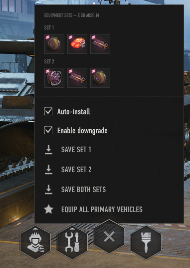

# Auto Equipment Return Mod by Z4imon

## Features
- Saves your tank equipment and automatically reinstalls it when selecting the tank
- Allows you to equip all your tanks with bounty equipment
- The equipment is pulled from depot or other tanks (only if demounting is free)
- *Downgrade:* if activated, installs a standard equipment instead of 
 the bounty or bond equipment if there is none available.
- *Equip all primary vehicles:* if clicked, installs the equipment for all the (filtered) 
  primary vehicles in your garage. Ideal for **Frontline**, **Onslaught** and **Onslaught light**.
  Using this, you have all your tanks for those game modes available within seconds.
  - Depending on the amount of vehicles, this takes time, this is normal!
  - After all equipments are succesfully equipped, the automatic equipment return is disabled 
    to allow browsing the other tanks.
- Allows you to import saved equipment from kurzdor's auto equipment return (only for the same account)
  - Done automatically on the first start of the mod or later over the modsettings 
- Allows you to import saved equipments from other accounts (within the mod)

## Dependencies
- **Wot Plus** or **Wot Plus Pro** subscription
- **Gameface** (https://gitlab.com/openwg/wot.gameface)
- **ModsSettingsAPI** (https://github.com/izeberg/modssettingsapi)

## Ingame
The mod menu opens with the button in the vehicle menu row of the hangar, right
next to the customization button.

- **Set 1** and **Set 2** show the equipment that is currently saved for the
  selected tank.
  - Tanks without a second loadout only show Set 1
- **Auto-install:** turns the automatic reinstalling on vehicle selection on
  and off
- **Enable downgrade:** If turned on installs the standard equipment when the bounty or bond
  one is not available for free
- **Save set 1** / **Save set 2** / **Save both sets:** saves the equipment
  currently mounted on the selected tank
- **Equip all primary vehicles:** equips all your filtered primary vehicles
  with their saved equipment

## Installation
- Download the mod from the official WoT Mods webside
- Unpack the downloaded file and move both .wotmod files into the world of tanks mod folder:
   *yourWoTInstallation/mods/currentGameVersion*
- If you already have gameface and the modssettingsapi installed, only move the auto-equipment-return file into the folder

## Contributing
Want to improve the mod? Please do! Fork the repository, make your changes and
open a pull request. 

Bug reports and ideas are welcome in my channel of the official WoT discord: [Z4imon's mods](https://discord.com/channels/161053416796323840/1496838335857954887) 

## License
[GPL-3.0](LICENSE) - you are free to use and modify this mod for yourself. If
you distribute it, modified or not, it has to stay under GPL-3.0 and you have
to make the source code available, keep the original copyright notice and mark
your changes.